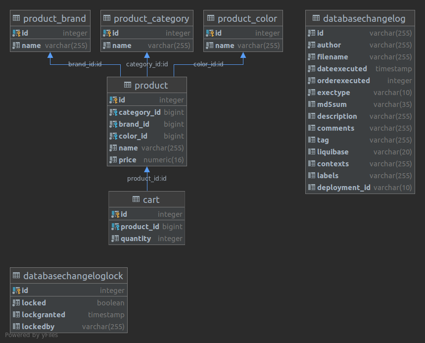
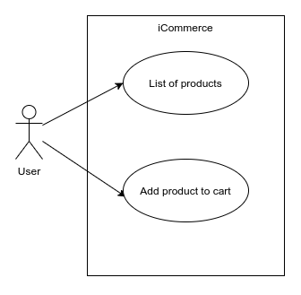
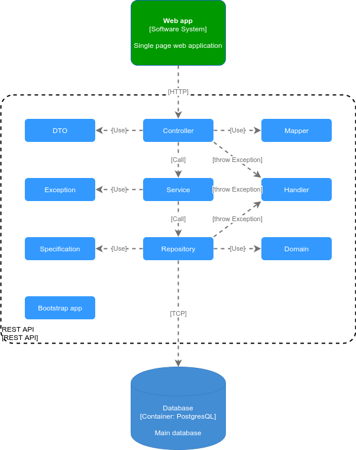
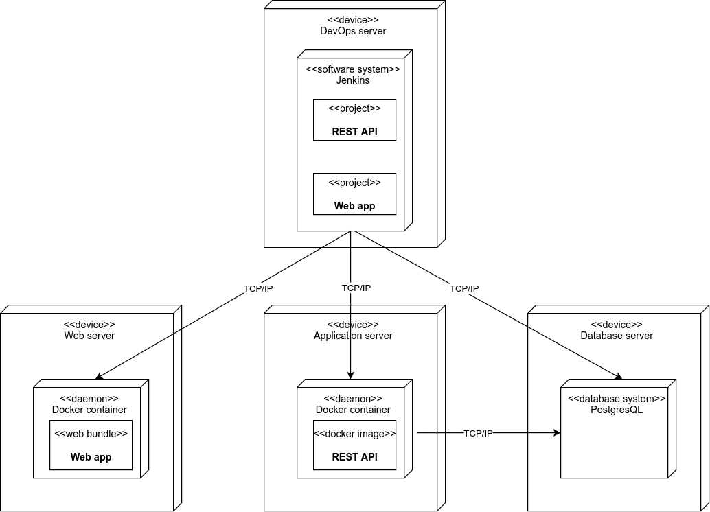

# 1. iCommerce REST API:

- Software development principles: SOLID.
- Software architecture: layered architecture. All layers are following:
    - controller: receive request from client.
    - service: handling the business logic and database transaction as well.
    - repository: manipulating with database, including fetching, inserting, updating, ...
    - model: declare the entity classes according to database tables.
    - dto: declare either the requests and responses DTO to represent the request and response.
    - exception: declare business exceptions when business logic couldn't pass the validations.
    - specification: declare specification that is derived from concepts introduced in Domain Driven Design book. The
      specifications help us to build complex query. [reference](https://spring.io/blog/2011/04/26/advanced-spring-data-jpa-specifications-and-querydsl/)
    - handler: declare global exception handler.

- Database: PostgresQL.
- REST API application.
- Framework: Spring Boot.
- Every unit tests locate in path:
  ```src/test/java```
  
- Creating the REST API application with production-ready concepts:\
  - Using strong framework which is Spring Boot.
  - No hard-coded configuration.
  - A lots of configuration via config file: datasource, jpa properties, database migration, i18n message.
  - Global exception handler.
  - DTO to entity and vice-versa mapper without reflection (using source generation mechanism).
  - Domain Driven Design's concepts which is specification.

# 2. Key libraries/frameworks:

See pom.xml:

- spring-boot-starter-web: the starter package for run app as a REST api.
- spring-boot-starter-data-jpa: the starter package for Spring Data JPA.
- spring-boot-starter-validation: the starter package for common validation.
- liquibase-core: the library to take charging of database migration.
- mapstruct: the library to define mapping functionalities from DTO to entity and vice-versa.
- postgresql: the library for database connection to PostgresQL database.
- lombok: the utility library to set up setter, getter and something for classes.
- spring-boot-starter-test: the starter package for running many kinds of tests in the project.

# 3. Running app:

1. Install JDK 8: https://docs.oracle.com/javase/8/docs/technotes/guides/install/install_overview.html
2. Install docker engine: https://docs.docker.com/engine/install/ \
   2.1. Install docker-compose: https://docs.docker.com/compose/install/
3. Run database in local machine:

3.1. go to docker-compose directory:

```
cd docker-compose
```

3.2. start database:

- Linux/Mac OS:

```
docker-compose up -d
```

- Windows:

```
docker volume create --name pgdata -d local
docker-compose -f docker-compose-windows.yml up -d
```

4. Clone source code:

```
git clone https://github.com/maihai86/iCommerce.git
cd iCommerce/rest
```

5. Build and start the app:
   5.1. build the app, including run all unit tests:

```
mvn clean package
```

**Run test only (for verifying the unit test results):**

```
mvn test
```

5.2. start the app:

- for test:

```
mvn spring-boot:run
```

- for production:

```
java -jar target/rest-0.0.1-SNAPSHOT.jar
```

**If you want to generate pre-data in order to, start the app with "test" profile:**

- for test:

```
mvn -Dspring.profiles.active=test spring-boot:run
```

- for production:

```
java -Dspring.profiles.active=test -jar target/rest-0.0.1-SNAPSHOT.jar
```

Now, the app is ready!

# 4. APIs:

a. Get a list of products, including filter by category, brand, color, and price range.

```
curl -X GET \
    -H "Content-type: application/json" \
    -H "Accept: application/json" \
    "http://localhost:8080/api/v1/products?category-id=1&brand-id=1&color-id=1&price-min=0&price-max=5100000"
```

Assume that we filter the list of products with combo box (dropdown box) in web UI. Hence I will use the ID of the input
criteria to pass to the parameters list of this API. You can change the criteria value to test this API by yourself.

b. Add a product to shopping cart:

```
curl -X POST \
    -H "Content-type: application/json" \
    -H "Accept: application/json" \
    -d '{"productId": 18, "quantity": 2}' \
    "http://localhost:8080/api/v1/carts"
```

Assume that I know the ID of the product which I want to add to my shopping cart. This is equivalent to what I could do
in the web UI, specially the product detail screen. You can change the product which is added to shopping cart by
changing the value of the property "productId" above.

# 5. ERD:



**Explanation:**
- databasechangelog and databasechangeloglock: the tables of the library Liquibase.
- product_brand: the table in which declare the brand of product.
- product_category: the table in which declare the category of product.
- product_color: the table in which declare the color of product.
- product: the table in which declare the product.
- cart: the table in which declare the identifier of product contains in the customer's shopping cart.

# 6. Architecture:
## a. Use cases:



- Request the list of products
- Add product to the shopping cart

## b. Container diagram:


I assume that we have a completed iCommerce system, including web application, REST API and main database. 
- Web app: User could use the functionalities of the iCommerce system through the web app. The web app connect to the below system through HTTP connection.
- Backend:
  - REST API: the REST API component. The main responsibilities are receiving requests from the web app, handling the business logic, fetching and saving to the main database, and the last one is sending response to the client. The used frameworks and libraries are Spring Boot, Spring Data JPA, lombok, mapstruct, Liquibase, Postgres connection driver.
  - Main database: PostgresQL, one of the most famous open source databases. The REST API connects to the main database through JDBC connection.

## c. Component diagram:



Here is the set of the components inside the REST API.
- Controller: the controller layer, the main responsibilities are receiving request of the client (specially the web app).
- Service: the service layer, the main responsibilities are receiving request of the controller layer, handling the business logic, handling the database transaction to take control of database consistency.
- Repository: the repository or DAO layer, the main responsibilities are handling data with the physical database, binding to Java POJO classes.
- DTO: declare data transfer object classes.
- Mapper: declare the mapper interfaces, the main responsibilities are converting from DTO to model and vice-versa.
- Exception: declare the custom exception.
- Handler: the global exception handler layer, the main responsibilities are handling whole exceptions to the REST API.
- Domain: declare POJO model classes.
- Specification: declare the specification classes, the utility that helps developer to write the complex query.
- Bootstrap application: the class to bootstrap Spring Boot app.

## d. Deployment diagram:



I assume that we have to deploy to the one-premise servers.
- DevOps server: I could use 1 server to deploy the DevOps's software systems to act as a CI/CD system.
- Application server: deploy the REST API.
- Web server: deploy the web application bundle.
- Database server: deploy the database software system.
